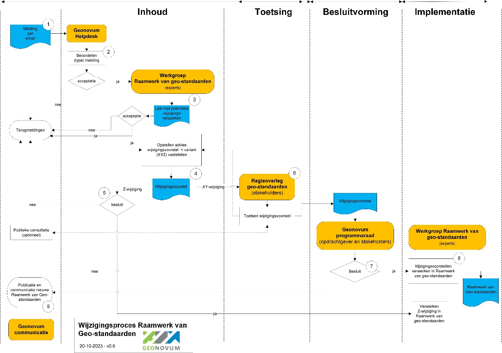

# Wijzigingsproces {#501FAB48}
De aanleiding voor een wijzigingsproces is gebaseerd op meldingen over de wensen en gevonden fouten in het <a href='https://docs.geostandaarden.nl/rwgs/rw/' target='_blank'>Raamwerk van geo-standaarden</a>. Dit zijn de wijzigingsverzoeken. Deze verzoeken worden door de Helpdesk geo-standaarden in behandeling genomen en in samenwerking met de werkgroep  Raamwerk van geo-standaarden verwerkt tot een wijzigingsvoorstel voor het Raamwerk. De beheerder neemt het initiatief om een wijzigingsproces te starten, de stappen in het proces zijn conform dit wijzigingsprotocol.
## Fasen in het wijzigingsproces {#554554BA}
Het volledige wijzigingsproces doorloopt de fasen Inhoud, Toetsing, Besluitvorming en Implementatie, zoals weergegeven in <a href='https://geonovum.github.io/IMG-wijzigingsprotocol/' target='_blank'><u>Figuur 1</u></a>.
<figure></img>
<figcaption><a href='https://geonovum.github.io/IMG-wijzigingsprotocol/' target='_blank'><u>Figuur 1</u></a> Fasen wijzigingsproces</figcaption></figure>

<b>Inhoud</b>
In de fase inhoud wordt voor ieder wijzigingsverzoek bepaald of deze wordt opgenomen in de nieuwe versie van het Raamwerk of niet. Dit wordt door de <b>Helpdesk geo-standaarden</b> intern vastgelegd. Ieder wijzigingsverzoek dat wordt meegenomen in de nieuwe versie van het Raamwerk, wordt een impactanalyse uitgevoerd. Met deze impactanalyse beoordeelt ook tot welke SemVer categorie de wijziging hoort, of de geo-standaard voldoet aan de criteria om in het Raamwerk te worden opgenomen en evt. welke betrokken partijen geraakt worden door de wijziging en wat de secundaire effecten van de wijziging zijn.
 
 
Wanneer tijdens de eerste impactanalyse is vastgesteld dat het om een X of Y wijziging gaat, wordt de <b>Werkgroep geo-standaarden</b> ingepland met de deskundigen. Afhankelijk van de omvang van de wijziging ten opzichte van de voorgaande versie en afhankelijk van welke stakeholders geraakt worden door de wijziging, verandert de samenstelling van de werkgroep. De werkgroep wordt vooraf geïnformeerd over het wijzigingsvoorstel en indien mogelijk wordt een eerste probleemschets en oplossing aangedragen voorafgaand aan de werkgroep. De resultaten van de werkgroep worden in een wijzigingsvoorstel voorgelegd aan de het <b>Regieoverleg geo-standaarden</b> met daarin een breder groep van stakeholders. 
 
 
<b>Toetsing</b>
De fase Toetsing vormt een brug tussen de inhoud en besluitvorming. In deze fase wordt voor een X of Y wijziging door het <b>Regieoverleg geo-standaarden</b> het wijzigingsvoorstel getoetst en van een advies voorzien voor besluitvorming in de <b>Programmaraad</b>. Met deze consultatie vragen wij de gebruikers en stakeholders van het Raamwerk actief hun reactie te geven op het wijzigingsvoorstel. Het wijzigingsvoorstel inclusief de terugkoppeling uit een evt. publieke consultatie wordt verwerkt in het wijzigingsvoorstel voor de besluitvorming van het Raamwerk van geo-standaarden.
 
 
<b>Besluitvorming</b>
Bij Besluitvorming wordt besloten om de gewijzigde vast te stellen en te publiceren. Afhankelijk van het type wijzigingsvoorstel (X, Y of Z, zie paragraaf proces varianten), besluit de <b>Programmaraad</b> van Geonovum voor X en Y wijzigingen en de <b>Werkgroep geo-standaarden</b> voor de Z wijzigingen.
 
 
<b>Implementatie</b>
Het verwerken van het wijzigingsvoorstel in het Raamwerk van geo-standaarden staat centraal in deze fase. Dit wordt gedaan door de <b>Werkgroep geo-standaarden. </b>
## Het wijzigingsproces in detail {#11E18F34}
De meldingen en wijzigingsverzoeken alsook (inter)nationale ontwikkelingen geven aanleiding tot de verdere ontwikkeling voor een standaard. Het wijzigingsproces dat dit wijzigingsvoorstel doorloopt bestaat uit tien stappen, die in onderstaande Figuur 2 in onderlinge samenhang zijn weergegeven. In deze figuur zijn processen, besluiten en de relevante actoren en actorgroepen en hun interacties opgenomen. Iedere processtap is vervolgens kort beschreven.
 
 
<figure></img>
<figcaption><a href='https://geonovum.github.io/IMG-wijzigingsprotocol/' target='_blank'><u>Figuur 2</u></a> Processchema wijzigingsbeheer Raamwerk van geo-standaarden</figcaption></figure>

<b>Processtappen</b>
De volgende processtappen worden doorlopen om te komen tot wijzigingen in de Raamwerk van geo-standaarden.
<ol><li>Met een ‘melding’ begint het wijzigingsproces. Doorgaans zal de gebruiker van een geo-standaard een eis of wens indienen, maar het kan ook het functioneel of technisch beheer zijn in sommige gevallen (bijv. wanneer een onderliggende standaard is bijgesteld). Er zijn meerdere aanleidingen, doorontwikkelingen of signalen, die kunnen leiden tot het indienen van een wijzigingsverzoek. Eisen en wensen, die kunnen leiden tot wijzigingen in het Raamwerk van geo-standaarden kunnen ontstaan ten gevolge van de volgende aanleidingen, doorontwikkelingen of signalen:<ul><li>Aanpassing van business doelen van de opdrachtgever;</li>
<li>Nieuwe of aangepaste wetgeving;</li>
<li>Aanpassing van aspecten van (onderliggende) standaarden;</li>
<li>Gewijzigde gebruikerswensen;</li>
<li>Wijzigingen in technische voorzieningen;</li>
<li>Wijzigingen in systemen waar mee gekoppeld wordt;</li>
<li>Het herstellen van fouten/bugs;</li>
<li>Het voor zijn van het optreden van fouten (preventief).</li>
</ul>
</li>
</ol>
De bovengenoemde aanleidingen kunnen leiden tot wijzigingsverzoeken in het Raamwerk van geo-standaarden, waarmee het wijzigingsproces in gang kan worden gezet. In het algemeen worden vier typen meldingen onderscheiden:
<ul><li>Een wijzigingsverzoek n.a.v. het adopteren van een nieuwe geo-standaard;</li>
<li>Een wijzigingsverzoek n.a.v. een (versie) update van een bestaande geo-standaard;  </li>
<li>Het afvoeren van een niet meer relevante geo-standaard.</li>
</ul>
De melding kan per mail gestuurd aan de <b>Helpdesk geo-standaarden</b>. Bij het aanmelden van meerdere wijzigingsverzoeken, geldt dat voor elk wijzigingsverzoek een aparte mail gestuurd moet worden.
<ol><li>De <b>Helpdesk geo-standaarden</b> registreert het wijzigingsverzoek in het meldingen systeem. De helpdesk beoordeelt het wijzigingsverzoek. De helpdesk is de actiehouder van de melding en controleert of de melding volledig en helder is. Bij een fout onderzoekt de helpdesk of dit inderdaad het geval is. Ook kan de helpdesk verder informatie opvragen bij de indiener van de melding. Ook wordt gecontroleerd of de melding geen duplicaat van een reeds ingevoerde melding. Indien de melding helder is beschreven, en het betreft een wens voor het aanpassen van de geo-standaard of een gevonden fout, dan kan melding worden erkend en wordt de melding formeel opgenomen in het meldingen systeem op <a href='https://github.com/Geonovum/raamwerk-geostandaarden/issues' target='_blank'>Github</a>. Indien de melding niet erkend wordt, zal de helpdesk via de mail contact opnemen met de indiener om de melding verder af te stemmen.</li>
<li>De binnengekomen meldingen wordt besproken in de <b>Werkgroep Raamwerk van geo-standaarden</b>, het overleg met geo-standaarden experts van Geonovum. De <b>Werkgroep</b> stelt op basis van de binnengekomen helpdesk meldingen jaarlijks een lijst met potentiële wijzigingsverzoeken op. Tevens wordt in deze stap door de Werkgroep een eerste impactanalyse uitgevoerd voor de wijzigingsverzoeken. De impactanalyse betreft de impact van de wijziging van de standaard op de gebruikers en de door hen gebruikte software. De resultaten van de impactanalyse worden gecommuniceerd op <a href='https://github.com/Geonovum/raamwerk-geostandaarden/issues' target='_blank'>Github</a>. Indien een melding wordt afgewezen – dus niet in de lijst met wijzigingsverzoeken wordt opgenomen – wordt door de Werkgroep een bericht met de verklaring van de afwijzing van de melding aan de indiener gestuurd.</li>
<li>De <b>W</b>erkgroep levert een wijzigingsvoorstel voor een nieuwe versie van het Raamwerk van geo-standaarden op voor het <b>Regieoverleg geo-standaarden</b> in geval van een X of Y-wijziging. </li>
<li>Indien het wijzigingsvoorstel enkel Z-wijziging(en) betreft, neemt de Werkgroep Raamwerk van geo-standaarden een besluit en gaat (al dan niet) over tot implementatie van de Z-wijziging. Het <b>Regieoverleg geo-standaarden</b> wordt over de wijziging geïnformeerd. </li>
<li>Het <b>Regieoverleg geo-standaarden</b> toetst het wijzigingsvoorstel voor de X of Y wijziging. In het <b>Regieoverleg geo-standaarden</b> hebben gebruikers en belangrijke stakeholders zitting. Indien nodig geacht door het <b>Regieoverleg geo-standaarden</b>, wordt in geval van een X-wijziging het wijzigingsvoorstel één maand ter publieke consultatie aangeboden op de <a href='https://www.geonovum.nl/geo-standaarden/informatiemodel-geluid' target='_blank'>website</a>. Dit is optioneel. De resultaten van de optionele publieke consultatie worden daarna getoetst door het <b>Regieoverleg geo-standaarden</b>.</li>
</ol>
Indien het <b>Regieoverleg geo-standaarden</b> instemt met het wijzigingsvoorstel, wordt het wijzigingsvoorstel met een positief advies aan de <b>Programmaraad Geonovum</b> gestuurd. In geval het <b>Regieoverleg geo-standaarden</b> het voorstel nog niet van een positief advies kan voorzien en eerst wijzigingen wil doorvoeren en het wijzigingsvoorstel wil laten bijstellen dan wel de impactanalyse wil bijstellen, dan gaat het voorstel terug naar de <b>Werkgroep</b>. De <b>Werkgroep</b> stelt vervolgens het wijzigingsvoorstel bij en brengt het wijzigingsvoorstel opnieuw in bij het <b>Regieoverleg geo-standaarden</b>. Na toetsing wordt een advies gestuurd aan <b>Programmaraad Geonovum</b> voor een besluit.
<ol><li>De <b>Programmaraad Geonovum</b> stelt het wijzigingsvoorstel van het Raamwerk van geo-standaarden vast. </li>
<li>Indien de <b>Programmaraad Geonovum</b> akkoord is met het wijzigingsvoorstel, wordt het wijzigingsvoorstel verwerkt in het Raamwerk van geo-standaarden door de <b>Werkgroep</b>. Indien het besluit tot implementatie negatief is, wordt terugmelding gemaakt aan de gebruikers en stakeholders en op de <a href='https://www.geonovum.nl/geo-standaarden/informatiemodel-geluid' target='_blank'>website</a>.</li>
<li>Na afronding van wijzigingsproces vindt communicatie plaats over de wijziging van het Raamwerk van geo-standaarden door <b>Geonovum Communicatie</b> via de website van Geonovum.</li>
</ol>
